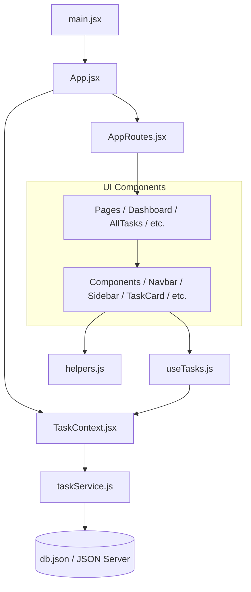

# TaskFlow Codebase Explanation & Reference Guide

Welcome to the **TaskFlow** codebase reference guide. This document provides a comprehensive overview of the architecture, folder structure, and individual code modules to help you understand how TaskFlow works under the hood.

---

## 🏗️ Architectural Overview

TaskFlow is designed as a client-server Single Page Application (SPA) built using React. It leverages the following design patterns and technologies:

### Key Architectural Layers:
1. **Entry Layer**: Bootstraps and mounts the React application onto the DOM.
2. **Layout Shell**: Implements global navigation, side navigation, footer, custom notifications (toasts), and system-wide keyboard shortcuts.
3. **Routing Layer**: Handles navigation and rendering page components based on URL pathnames.
4. **State Management Layer (React Context API)**: Centralizes data (tasks, activities, search/filter states) and distributes it globally to avoid prop-drilling.
5. **Service API Layer (Axios)**: Abstracts HTTP methods to communicate with the mock database server (`json-server`).
6. **Component Hierarchy**: Divided into standalone components (buttons, badges, cards, filters) and pages (full-screen views representing specific features).
7. **Utility Helpers**: Pure utility functions handling common date calculations, priority weights, and time comparisons.

---

## 📂 Complete Folder Structure Reference

Here is a map of the file locations in this workspace:

- [package.json](file:///c:/Users/shubh/OneDrive/Desktop/Todo/package.json): Defines dependencies, devDependencies, and run scripts.
- [db.json](file:///c:/Users/shubh/OneDrive/Desktop/Todo/db.json): Local JSON-based Mock database.
- `src/`
  - [main.jsx](file:///c:/Users/shubh/OneDrive/Desktop/Todo/src/main.jsx): React bootstrapper.
  - [App.jsx](file:///c:/Users/shubh/OneDrive/Desktop/Todo/src/App.jsx): Main layout template, keybindings, and notification toast shell.
  - [styles.css](file:///c:/Users/shubh/OneDrive/Desktop/Todo/src/styles.css): CSS variables, layout, custom responsive wrappers, and animations.
  - `context/`
    - [TaskContext.jsx](file:///c:/Users/shubh/OneDrive/Desktop/Todo/src/context/TaskContext.jsx): Centralized state engine, CRUD executors, filters, and notification state.
  - `hooks/`
    - [useTasks.js](file:///c:/Users/shubh/OneDrive/Desktop/Todo/src/hooks/useTasks.js): Convenient consumer hook for using `TaskContext`.
  - `routes/`
    - [AppRoutes.jsx](file:///c:/Users/shubh/OneDrive/Desktop/Todo/src/routes/AppRoutes.jsx): Route mappings.
  - `utils/`
    - [helpers.js](file:///c:/Users/shubh/OneDrive/Desktop/Todo/src/utils/helpers.js): Helper utilities for dates and weight priorities.
  - `services/`
    - [taskService.js](file:///c:/Users/shubh/OneDrive/Desktop/Todo/src/services/taskService.js): Axios HTTP API connector.
  - `components/`
    - [Navbar.jsx](file:///c:/Users/shubh/OneDrive/Desktop/Todo/src/components/Navbar.jsx): Navigation header with search integration and urgent alerts indicator.
    - [Sidebar.jsx](file:///c:/Users/shubh/OneDrive/Desktop/Todo/src/components/Sidebar.jsx): Navigation drawer with real-time reactive task counters.
    - [Footer.jsx](file:///c:/Users/shubh/OneDrive/Desktop/Todo/src/components/Footer.jsx): Bottom info bar showing hotkeys.
    - [TaskCard.jsx](file:///c:/Users/shubh/OneDrive/Desktop/Todo/src/components/TaskCard.jsx): Task container for Grid layouts.
    - [TaskTable.jsx](file:///c:/Users/shubh/OneDrive/Desktop/Todo/src/components/TaskTable.jsx): Tabular listing for List layouts.
    - [TaskForm.jsx](file:///c:/Users/shubh/OneDrive/Desktop/Todo/src/components/TaskForm.jsx): Shared reusable form for creating/editing tasks with validation.
    - [SearchBar.jsx](file:///c:/Users/shubh/OneDrive/Desktop/Todo/src/components/SearchBar.jsx): Advanced keyboard-aware search field.
    - [FilterBar.jsx](file:///c:/Users/shubh/OneDrive/Desktop/Todo/src/components/FilterBar.jsx): Dropdown controls to filter and sort tasks.
    - [StatusBadge.jsx](file:///c:/Users/shubh/OneDrive/Desktop/Todo/src/components/StatusBadge.jsx): Dynamic styling component for task priority and completion state.
    - [ConfirmModal.jsx](file:///c:/Users/shubh/OneDrive/Desktop/Todo/src/components/ConfirmModal.jsx): Multi-purpose safety modal for deleting tasks.
    - [Loader.jsx](file:///c:/Users/shubh/OneDrive/Desktop/Todo/src/components/Loader.jsx): Loading indicator.
  - `pages/`
    - [Dashboard.jsx](file:///c:/Users/shubh/OneDrive/Desktop/Todo/src/pages/Dashboard.jsx): Metrics summary dashboard using `react-chartjs-2` visual charts and activity feed.
    - [AllTasks.jsx](file:///c:/Users/shubh/OneDrive/Desktop/Todo/src/pages/AllTasks.jsx): Paginated grid/list task manager.
    - [AddTask.jsx](file:///c:/Users/shubh/OneDrive/Desktop/Todo/src/pages/AddTask.jsx): Creation view.
    - [EditTask.jsx](file:///c:/Users/shubh/OneDrive/Desktop/Todo/src/pages/EditTask.jsx): Edit view with route params loading.
    - [Completed.jsx](file:///c:/Users/shubh/OneDrive/Desktop/Todo/src/pages/Completed.jsx): Filter wrapper.
    - [Pending.jsx](file:///c:/Users/shubh/OneDrive/Desktop/Todo/src/pages/Pending.jsx): Filter wrapper.
    - [HighPriority.jsx](file:///c:/Users/shubh/OneDrive/Desktop/Todo/src/pages/HighPriority.jsx): Filter wrapper.
    - [Settings.jsx](file:///c:/Users/shubh/OneDrive/Desktop/Todo/src/pages/Settings.jsx): Hotkey reference and connection details.
    - [NotFound.jsx](file:///c:/Users/shubh/OneDrive/Desktop/Todo/src/pages/NotFound.jsx): Custom 404 screen.

---

## 🛠️ Detailed Module & Code Walkthrough

### 1. Bootstrapping Layer

#### 📄 [main.jsx](file:///c:/Users/shubh/OneDrive/Desktop/Todo/src/main.jsx)
- **Role**: Entry point of the application.
- **Key Logic**: Instantiates the React virtual DOM tree, attaches it to the HTML root container (`#root`), imports global [styles.css](file:///c:/Users/shubh/OneDrive/Desktop/Todo/src/styles.css), and wraps the application in `React.StrictMode` to help detect potential side effects during development.

#### 📄 [App.jsx](file:///c:/Users/shubh/OneDrive/Desktop/Todo/src/App.jsx)
- **Role**: Core layout orchestrator, keyboard listener, and notifications controller.
- **Key Logic**:
  - Implements **Global Keyboard Shortcuts**: Handles `Shift + N`/`Shift + C` (navigate to create task), `Shift + D` (navigate to Dashboard), and `Shift + A` (navigate to All Tasks) using a `useEffect` hook listening to keydown events. It ensures these do not trigger when the user is typing inside textareas, inputs, or selects.
  - Implements **Custom Toast Notifications Stack**: Listens to the `toasts` array distributed by `TaskContext` and renders floating notification alerts (Success, Warning, Info, Danger) in the bottom-right corner.
  - Configures **Global Context Providers**: Wraps the layout inside `<BrowserRouter>` (React Router engine) and `<TaskProvider>` (global state supplier).

---

### 2. State & Data Layer

#### 📄 [taskService.js](file:///c:/Users/shubh/OneDrive/Desktop/Todo/src/services/taskService.js)
- **Role**: Communicates with the REST API backend.
- **Key Logic**:
  - Configures a centralized Axios instance with `baseURL` set to `http://localhost:5000` (the default port of the JSON server).
  - Exposes an object `taskService` containing CRUD promises:
    - `getTasks()`: Fetches all tasks.
    - `getTask(id)`: Fetches a single task by ID.
    - `addTask(task)`: POSTs a new task payload.
    - `updateTask(id, task)`: PUTs modified task data back.
    - `deleteTask(id)`: DELETEs a task record.
    - `getActivities()`: Fetches recent activities, automatically sorted by timestamp in descending order and capped at 10 items.
    - `addActivity(activityText)`: Logs user actions into the database activity history.

#### 📄 [TaskContext.jsx](file:///c:/Users/shubh/OneDrive/Desktop/Todo/src/context/TaskContext.jsx)
- **Role**: The centralized "brains" of the application.
- **Key Logic**:
  - Contains core states: `tasks`, `activities`, `loading`, `error`, search query, status filters (`filterStatus`), priority filters (`filterPriority`), category filters (`filterCategory`), sorting configuration (`sortBy`), and active toast array (`toasts`).
  - **Confetti on Completion**: Implements `toggleTaskStatus(id)` which inverts the task completion status. If a task status changes to `Completed`, it triggers the dependency `canvas-confetti` to shoot celebratory confetti across the screen!
  - **Activity Auditing**: When tasks are added, edited, toggled, or deleted, `TaskContext` logs a formatted action string to the server database through `taskService.addActivity()` and refetches the list so the Dashboard updates instantly.
  - **Dynamic Toast Stack**: Exposes `showToast()` and `removeToast()` which generate temporary UI notifications. They use timers (`setTimeout`) to automatically dismiss notifications after 4 seconds.
  - **Auto-Extracting Categories**: Calculates `categories` dynamically by examining all tasks in the list, making sure there is always a list of categories ready for the search/filter dropdown bar.

#### 📄 [useTasks.js](file:///c:/Users/shubh/OneDrive/Desktop/Todo/src/hooks/useTasks.js)
- **Role**: Custom React hook for context consumption.
- **Key Logic**: Wraps `useContext(TaskContext)` and throws a clear runtime error if developer components try to access task properties outside the scope of `<TaskProvider>`. This ensures robust types/references safety.

---

### 3. Navigation & Routing Layer

#### 📄 [AppRoutes.jsx](file:///c:/Users/shubh/OneDrive/Desktop/Todo/src/routes/AppRoutes.jsx)
- **Role**: Configures routes inside the page layout wrapper.
- **Key Logic**: Map paths to visual page modules:
  - `/` 👉 [Dashboard.jsx](file:///c:/Users/shubh/OneDrive/Desktop/Todo/src/pages/Dashboard.jsx)
  - `/tasks` 👉 [AllTasks.jsx](file:///c:/Users/shubh/OneDrive/Desktop/Todo/src/pages/AllTasks.jsx)
  - `/add` 👉 [AddTask.jsx](file:///c:/Users/shubh/OneDrive/Desktop/Todo/src/pages/AddTask.jsx)
  - `/edit/:id` 👉 [EditTask.jsx](file:///c:/Users/shubh/OneDrive/Desktop/Todo/src/pages/EditTask.jsx)
  - `/completed` 👉 [Completed.jsx](file:///c:/Users/shubh/OneDrive/Desktop/Todo/src/pages/Completed.jsx)
  - `/pending` 👉 [Pending.jsx](file:///c:/Users/shubh/OneDrive/Desktop/Todo/src/pages/Pending.jsx)
  - `/high-priority` 👉 [HighPriority.jsx](file:///c:/Users/shubh/OneDrive/Desktop/Todo/src/pages/HighPriority.jsx)
  - `/settings` 👉 [Settings.jsx](file:///c:/Users/shubh/OneDrive/Desktop/Todo/src/pages/Settings.jsx)
  - `*` (Catch-all fallback) 👉 [NotFound.jsx](file:///c:/Users/shubh/OneDrive/Desktop/Todo/src/pages/NotFound.jsx)

---

### 4. Component Library

#### 📄 [Navbar.jsx](file:///c:/Users/shubh/OneDrive/Desktop/Todo/src/components/Navbar.jsx)
- **Role**: Responsive top navigation header.
- **Key Logic**:
  - Renders the brand logo, search control input, notification drawer, and administrator avatar profile card.
  - **Search Shortcuts**: Employs keyboard listener for `/` which automatically focuses the cursor inside the header search bar.
  - **Real-Time Notification Drawer**: Filters tasks using [isOverdue](file:///c:/Users/shubh/OneDrive/Desktop/Todo/src/utils/helpers.js#L41) and [isDueToday](file:///c:/Users/shubh/OneDrive/Desktop/Todo/src/utils/helpers.js#L52). It calculates the sum and overlays a red notification badge. Clicking the bell icon reveals a dropdown list displaying a list of urgent task alerts (red for overdue, orange/yellow for due today) which link to the tasks.

#### 📄 [Sidebar.jsx](file:///c:/Users/shubh/OneDrive/Desktop/Todo/src/components/Sidebar.jsx)
- **Role**: Left navigation panel.
- **Key Logic**:
  - Displays links to specific pages.
  - Computes and renders real-time counters: total tasks, pending tasks, completed tasks, and high-priority tasks. These badges update dynamically when state mutations occur.
  - Includes a helpful drawer toggle indicator (`?` keyboard shortcut reminder).

#### 📄 [Footer.jsx](file:///c:/Users/shubh/OneDrive/Desktop/Todo/src/components/Footer.jsx)
- **Role**: Bottom status line.
- **Key Logic**: Displays copyrights and keyboard cheat-sheet shortcuts (e.g., `<kbd>` elements representing key combinations like `Shift + N` for task creation).

#### 📄 [SearchBar.jsx](file:///c:/Users/shubh/OneDrive/Desktop/Todo/src/components/SearchBar.jsx)
- **Role**: Inline full-width search input panel.
- **Key Logic**:
  - Syncs input value with `searchQuery` state from `TaskContext`.
  - Implements keyboard shortcut listeners (focuses on `/` or `s` keys).
  - Displays an "X" button on the right edge to clear queries easily.

#### 📄 [FilterBar.jsx](file:///c:/Users/shubh/OneDrive/Desktop/Todo/src/components/FilterBar.jsx)
- **Role**: Sub-controls bar for refining task list displays.
- **Key Logic**: Contains a set of selectors connected to global states:
  - **Status Filter**: All, Pending, Completed.
  - **Priority Filter**: All, High, Medium, Low.
  - **Category Filter**: Renders a dropdown options list generated dynamically from existing categories (e.g. Development, Design).
  - **Sort Dropdown**: Triggers sorting algorithms based on latest created, oldest created, due date, priority scale, or title alphabetical string sorting.

#### 📄 [StatusBadge.jsx](file:///c:/Users/shubh/OneDrive/Desktop/Todo/src/components/StatusBadge.jsx)
- **Role**: Configures color properties for task statuses and priorities.
- **Key Logic**: Renders custom pills:
  - Statuses (`Pending` / `Completed`) render with icons (check circle / hourglass) and colors mapped from CSS variables (`var(--success-color)` / `var(--warning-color)`).
  - Priorities (`High` / `Medium` / `Low`) are mapped to warning, danger, or info classes.

#### 📄 [TaskCard.jsx](file:///c:/Users/shubh/OneDrive/Desktop/Todo/src/components/TaskCard.jsx)
- **Role**: UI representation of a single task in Grid mode.
- **Key Logic**:
  - Contains title, category badge, priority badge, description text (trimmed via CSS `text-truncate-3`), formatted due date, check toggle box, and action buttons (Edit, Delete).
  - **Adaptive Styling**: Adapts card borders, icons, and text styles depending on task conditions (e.g., due today uses yellow borders, overdue uses red borders and text, completed uses text strikethrough).

#### 📄 [TaskTable.jsx](file:///c:/Users/shubh/OneDrive/Desktop/Todo/src/components/TaskTable.jsx)
- **Role**: UI representation of tasks in List mode.
- **Key Logic**: Renders an interactive table layout using React Bootstrap classes. Features include a toggle checkbox column, descriptive summaries, category badges, due date badges with warnings, priority chips, status pills, and edit/delete quick action triggers.

#### 📄 [TaskForm.jsx](file:///c:/Users/shubh/OneDrive/Desktop/Todo/src/components/TaskForm.jsx)
- **Role**: Form component used to create or edit task details.
- **Key Logic**:
  - Renders input text control fields for title, description, category select picker, priority select picker, due date picker, and status.
  - **Add Custom Category**: When category option "+ Custom Category" is chosen, it displays a text input allowing the user to create a new category name.
  - **Validation Rules**:
    - Task title cannot be empty and must be at least 5 characters.
    - Custom category name cannot be blank.
    - Due dates must not be in the past for new tasks.
  - Form handles pre-population during edit mode via `initialTask` checks inside a `useEffect` controller hook.

#### 📄 [ConfirmModal.jsx](file:///c:/Users/shubh/OneDrive/Desktop/Todo/src/components/ConfirmModal.jsx)
- **Role**: Center-aligned modal confirming destructive actions.
- **Key Logic**: Displays warning indicators (exclamation triangle icon, red confirmation actions) when deleting tasks.

#### 📄 [Loader.jsx](file:///c:/Users/shubh/OneDrive/Desktop/Todo/src/components/Loader.jsx)
- **Role**: Screen loader.
- **Key Logic**: Displays standard full-page or section spinners during asynchronous data fetching.

---

### 5. Application Pages

#### 📄 [Dashboard.jsx](file:///c:/Users/shubh/OneDrive/Desktop/Todo/src/pages/Dashboard.jsx)
- **Role**: Main administrative entry view.
- **Key Logic**:
  - Renders top row metrics counters (Total, Completed, Pending, High Priority, Due Today, Overdue).
  - Computes and renders **3 ChartJS Visualizations**:
    1. **Task Completion Status** (Doughnut Chart): Completed vs Pending ratio.
    2. **Priority Distribution** (Bar Chart): Total of High, Medium, and Low priority items.
    3. **Category Breakdown** (Bar Chart): Dynamic counts of tasks grouped by categories.
  - **Urgent Action Banner**: Highlights outstanding action tasks in red if any overdue/due today tasks exist.
  - **Recent Activity Feed**: Renders the 5 most recent activity audit statements tracked in the database.
  - **Critical Actions Needed**: Shows a quick-list of the first 4 tasks that are either overdue or due today.

#### 📄 [AllTasks.jsx](file:///c:/Users/shubh/OneDrive/Desktop/Todo/src/pages/AllTasks.jsx)
- **Role**: Central task hub with advanced controls.
- **Key Logic**:
  - Includes toggle controls to switch layout layouts between **Grid** and **List**.
  - **Client-Side Filtering & Search Processing**:
    - Evaluates inputs in search filters (title/description/category strings).
    - Refines lists using dropdowns (Status, Priority, Category).
  - **Client-Side Sorting**:
    - Re-orders the final list according to the selected sorting option.
  - **Client-Side Pagination**:
    - Splits the filtered/sorted tasks into sub-pages (6 per page for Grid layout, 10 per page for List layout). Calculates the indices, and displays custom styled pagination elements.
  - Triggers the safety deletion confirmation modal before deletion commands execute.

#### 📄 [AddTask.jsx](file:///c:/Users/shubh/OneDrive/Desktop/Todo/src/pages/AddTask.jsx)
- **Role**: Task creator view.
- **Key Logic**: Pulls `addTask` function from the context hook and wraps [TaskForm.jsx](file:///c:/Users/shubh/OneDrive/Desktop/Todo/src/components/TaskForm.jsx) configured in creation mode.

#### 📄 [EditTask.jsx](file:///c:/Users/shubh/OneDrive/Desktop/Todo/src/pages/EditTask.jsx)
- **Role**: Task updater view.
- **Key Logic**:
  - Uses `useParams` to extract the task ID from the URL query path.
  - Finds the corresponding task in the local tasks list.
  - Displays a Warning Banner if the ID does not match any current task.
  - Loads [TaskForm.jsx](file:///c:/Users/shubh/OneDrive/Desktop/Todo/src/components/TaskForm.jsx) in edit mode, mapping the update function back to the server database.

#### 📄 [Completed.jsx](file:///c:/Users/shubh/OneDrive/Desktop/Todo/src/pages/Completed.jsx), [Pending.jsx](file:///c:/Users/shubh/OneDrive/Desktop/Todo/src/pages/Pending.jsx), [HighPriority.jsx](file:///c:/Users/shubh/OneDrive/Desktop/Todo/src/pages/HighPriority.jsx)
- **Role**: Lightweight filter pages.
- **Key Logic**: Reuse [AllTasks.jsx](file:///c:/Users/shubh/OneDrive/Desktop/Todo/src/pages/AllTasks.jsx) component with limit parameters (`limitStatus="Completed"`, `limitStatus="Pending"`, `limitPriority="High"`) to filter and show specific subsets of tasks.

#### 📄 [Settings.jsx](file:///c:/Users/shubh/OneDrive/Desktop/Todo/src/pages/Settings.jsx)
- **Role**: Information page.
- **Key Logic**: Renders keyboard shortcut instructions and details about the application status (such as mock API ports and server configurations).

#### 📄 [NotFound.jsx](file:///c:/Users/shubh/OneDrive/Desktop/Todo/src/pages/NotFound.jsx)
- **Role**: Custom 404 page.
- **Key Logic**: Displays a warning alert box with a redirect button back to the dashboard if a route is not matched.

---

### 6. Utility Layer

#### 📄 [helpers.js](file:///c:/Users/shubh/OneDrive/Desktop/Todo/src/utils/helpers.js)
- **Role**: Houses common date formatters and helper rules.
- **Key Logic**:
  - `getTodayDateString()`: Returns local YYYY-MM-DD string.
  - `formatDate(dateStr)`: Converts standard YYYY-MM-DD input formats into formatted text string formats (e.g. `Jul 14, 2026`), resolving local offset issues.
  - `isOverdue(task)`: Returns true if the task status is not completed and the task due date is chronologically before today's date.
  - `isDueToday(task)`: Returns true if the task is not completed and the task due date matches today's date.
  - `getPriorityWeight(priority)`: Maps priorities (`High` = 3, `Medium` = 2, `Low` = 1, default = 0) to support sorting tasks by weight.

---

### 7. Configurations

#### 📄 [package.json](file:///c:/Users/shubh/OneDrive/Desktop/Todo/package.json)
- **Role**: Project configuration.
- **Key Logic**:
  - Imports critical dependencies: `axios`, `bootstrap` & `react-bootstrap` (styling framework), `canvas-confetti` (interactive celebrations), `chart.js` & `react-chartjs-2` (data visualization), `react-router-dom` (routing engine).
  - Dev dependencies include `vite` (bundler), `json-server` (local REST API), and `oxlint` (speedy linter).
  - Scripts: `npm run dev` starts the Vite server.

#### 📄 [db.json](file:///c:/Users/shubh/OneDrive/Desktop/Todo/db.json)
- **Role**: Backend database file loaded by JSON Server.
- **Key Logic**: Holds JSON arrays representing `tasks` records (title, description, priority, category, dueDate, status, createdAt) and the logged database transaction audit array (`activities`).

---

## 🎨 Styling System Summary

#### 📄 [styles.css](file:///c:/Users/shubh/OneDrive/Desktop/Todo/src/styles.css)
TaskFlow uses Vanilla CSS variables alongside Bootstrap classes for layout and visual styling. Key patterns include:
- **Design Tokens**: Configures theme colors as custom properties (e.g. `--primary-color: #2563eb;`, `--success-color: #16a34a;`, `--danger-color: #dc2626;`, etc.).
- **Card Hover Effects**: Uses custom transition properties (`transform: translateY(-4px); box-shadow: ...`) on `.task-card` to provide subtle micro-animations when hovering.
- **Responsive Layout Wrapper**: Uses flexbox configurations on `.app-container` and `.app-main` to handle responsive layouts across mobile and desktop viewports, sliding the sidebar in/out when toggled.
- **Empty States**: Customized design layouts with SVG filters for empty search results.
